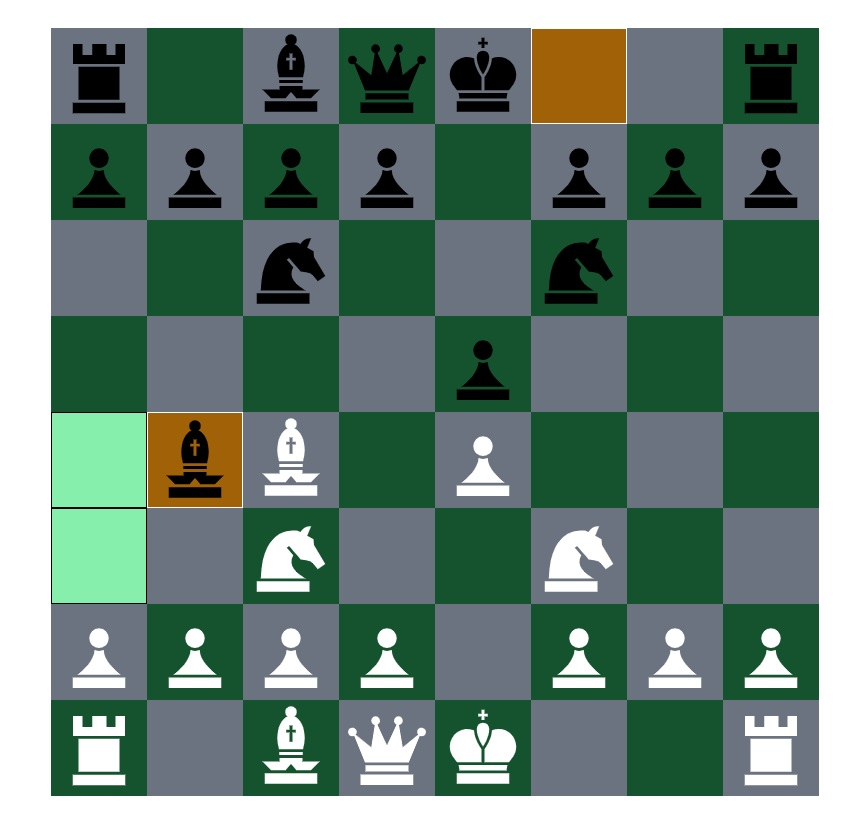

# Chess 2.0

A chess platform where you can play against AI or online.
I built the platform from scratch without using ready-made chess or AI libraries for the sake of learning.

try it yourself at: https://chess2-0-client.netlify.app

## Table Of Contents

- [Chess 2.0](#Chess-2.0)
  - [Why was Chess 2.0 made](#Why-was-Chess-2.0-made)
  - [Running the project](#running-the-project)
  - [Screenshots](#screenshots)
  - [Technologies](#technologies)
    - [Client-Side](#client-side)
    - [Server-Side](#server-side)
  - [Whats Next](#whats-next)

## Why was Chess 2.0 made

Chess 2.0 was made to learn more about complex applications that have complex data stractures and algorithems.

## Running the project

1. Clone the repo.
2. Run `npm install` in client server and ai folders.
3. enter the server folder.
4. run `npm start`.
5. enter the ai folder.
6. run `npm start`.
7. enter the client folder.
8. Run `npm start`.
9. Navigate to `http://localhost:3000`.

## Screenshots

## Technologies:

### Client-side:

- React.JS
- TailWind

### Server-side:

- Node.JS
- Express
- MongooDB

## What's next:

1. Improving the ai to beat every player in the world ;)
